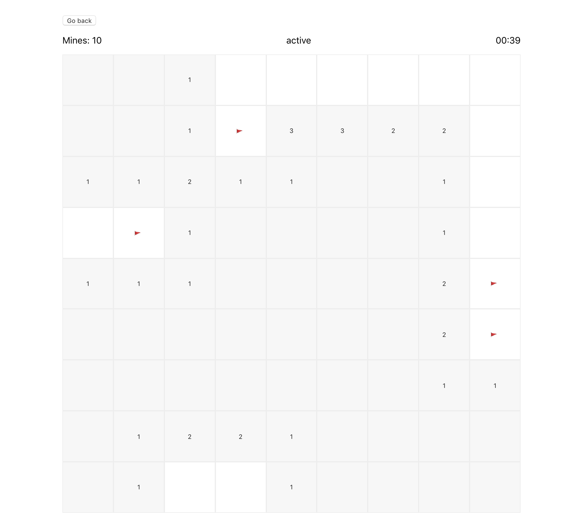

# [Minesweeper](https://minesweeper-frontend-jm.herokuapp.com)



## First steps
Make sure you have:
- Ruby (I used ruby 2.6.1)
- Rails
- Node
- npm
- Foreman (you can install it with `gem install foreman`)

For the first time you will need to:
```
cd api
rails db:create db:migrate
cd ../frontend
npm install
```

To start the development environment run the following command (in the root directory):
```
./bin/start
```

## Notes
[Api notes](/api/readme.md)
[Frontend notes](/frontend/readme.md)

## Deployment
Make sure to have the git remotes (called `heroku-api` and `heroku-frontend`) already configured for the api and the frontend (currently hosted in heroku).
From the root directoy:
- Api: `git subtree push --prefix api heroku-api master`
- Frontend: `git subtree push --prefix frontend heroku-frontend master`
